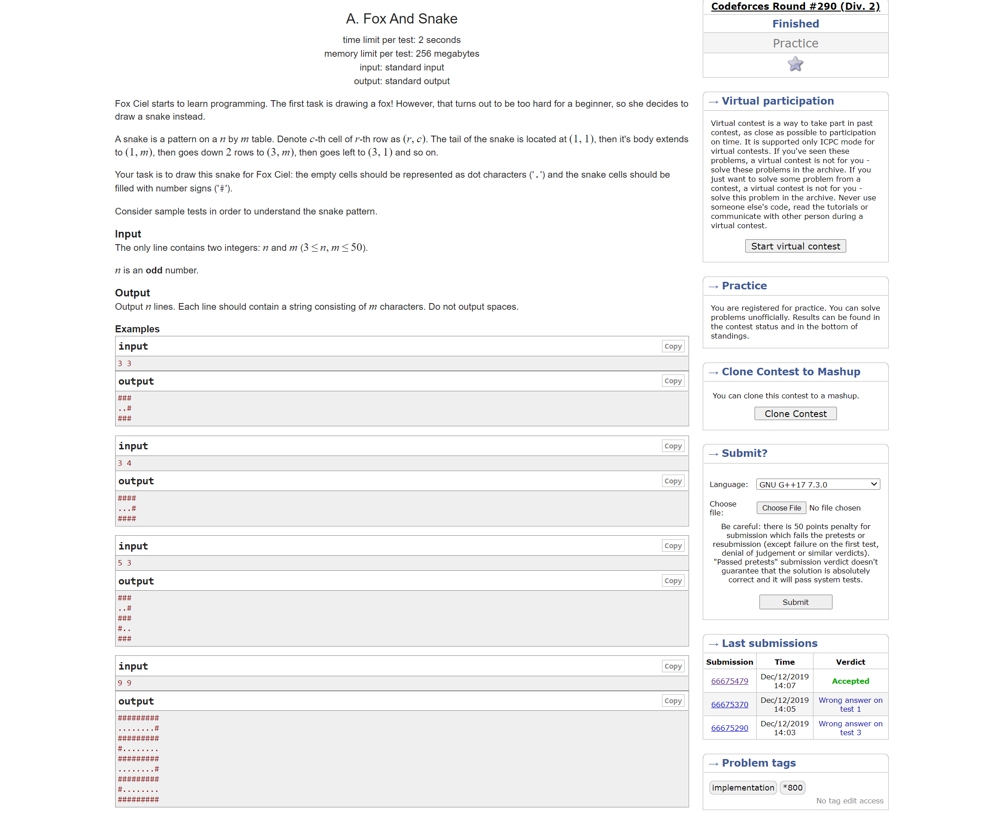

## Analysis

> - [ ] Described and justified the features that make the problem solvable by computational methods, explaining why it is amenable to a computational approach. 
> - [ ] Identified suitable stakeholders for the project and described them explaining how they will make use of the proposed solution and why it is appropriate to their needs. 
> - [ ] Researched the problem in- [ ]depth looking at existing solutions to similar problems, identifying and justifying suitable approaches based on this research. 
> - [ ] Identified the essential features of the proposed computational solution explaining these choices. 
> - [ ] Identified and explained with justification any limitations of the proposed solution. 
> - [ ] Specified and justified the requirements for the solution including (as appropriate) any hardware and software requirements. 
> - [ ] Identified and justified measurable success criteria for the proposed solution. 

### Description of the problem

A Level Computer Science students are required to learn many algorithms and data structures. In an actual exam, they are asked to handwriting the algorithm to solve some problems. Many students find it is hard to achieve high score in those type of questions due to the lack of efficient training. When the students learn and practice the algorithms, the general procedure is that they are given some questions from the teacher, then they attempt to solve them by themselves, and finally they self mark their solution based on the mark scheme. This procedure works well for general questions. However, for the algorithm questions, different students will produce completely different code solutions, which makes the self marking very unreliable. It is also too much work for the teacher to mark the solution one by one. So in the end, students do not know whether they get things right and teachers do not know how the students perform and how they can help - especially in this lockdown online learning era where no direct contact between teacher and students is possible.

Both the students and the teachers are looking for a more efficient method to learn and practice.

I would like to develop a software solution to solve this problem. The software will contain:
- A local database to store algorithm coding questions
- A graphical user interface to display the questions and provide interaction with all other functions
- A code editor for the student to input their solutions
- A question editor for the teacher to create questions and test cases
- A judger which can automatically mark the students' answer based on the test cases
- A data analyzer that provides basic functions for the teachers to analyze students' performance

### Stakeholders

> For the highest marks in this section make sure not just simply list our users/stakeholders.  Make sure to explain how they will make use of your proposed solution and explain why it is suitable for their needs.
> 1.  Who are the stakeholders/end users?
> 2.  What problem do they have?
> 3.  How will they make sure of your proposed solution and why is it appropriate to their needs?

There are two types of stakeholders, Computer Science teachers and Computer Science students.

#### Computer Science Teachers

- [ ] Ms Salama (Computer Science teacher)
- [ ] Mr Grimwood (Computer Science teacher)

Computer Science teachers find it is difficult to monitor their students' understanding of the coding and algorithms part of the subject, so they cannot provide sufficient help to their students. This software allows them to create such type of coding questions and send them to the students. After the students hand their solutions back, the software will automatically mark their answers and provide detailed statistical data with visualisations. This helps the teachers saving a lot of time and allows them to help the students better.

#### Computer Science Students

- [ ] Some random CS students (TODO)

The students find they tend to lose mark on the algorithms coding questions and they want more practice on it. But unlike normal questions, they may take a completely different approach towards the questions compare to the mark scheme so they do not know whether they get it correct. The students may also think they have got things correct but actually they have made some mistakes. The software provides a free practice space which automatically marks their solutions and points out their mistakes in real-time, so they can learn and revise more efficiently. 

### Solve by computational methods

> For the highest marks in this section, you MUST make sure to clearly explain why the problem you are solving is amenable to a computational approach.  In other words, you have decided to write a computer program for your project, and this program solves some kind of problem or meets some need.  Not every problem can be solved computationally, there are problems out there for which a computer program based solution is not appropriate or indeed possible, yours is, explain this.

#### Thinking Abstractly 

> How will your problem simplify reality?  If you are producing a game, simulation, training aid, booking system etc what detail is important and what details from reality will you ignore or omit?

In reality, students use pen and paper to write their code solutions. This can be simplified by a code editor and the students can use the keyboard to type in their code. In this way, no "text scanning" or "handwriting recognization" is needed which makes the designing and programming much easier. The code editor will also provide a better user experience. Features such as syntax highlighting cannot exist on paper but are possible in the abstracted code editor.

In reality, the students' answer is sent to a teacher to mark it against the mark scheme. The teacher needs to read the code line by line and check whether it is correct. This process is simplified into a judger that marks the code against pre-generated test cases, which transforms a problem that originally cannot be solved by computational method into one which is very easy to be solved by a computer while saving time and costs. When creating a new question, instead of creating a mark scheme for marking, the teacher needs to provide test cases with the correct input and expected output. The judger will run the students' submissions with the input and check whether their output matches the expected one. But this transformation is not completely perfect, there are limitations with it. First, generating good test cases is much time consuming than writing a mark scheme, it is very likely for a wrong solution to pass the judging if the test cases are not good enough. Second, the judger can only simply compare the students' output with the expected output, if there is a format error such as trailing space and extra newline in their output, which will not be considered as a mistake in a real exam, will be marked as a wrong answer by the judger. So students may need to spend extra time debugging their output format. This problem simply cannot be solved by any computational method, it relies on the teacher who creates the questions to consider everything clearly to minimize its impact. 

#### Thinking Ahead

> What data/inputs will be required for your solution to work?

There are two types of input required.

For the teacher, the software requires them to input the question and test cases as a text file. A question editor need to be provided for this purpose.

For the students, the software requires them to input their code solutions to give them feedback. A code editor need to be provided for this purpose.

A relational database is need to store all the input data.

(TODO)

#### Thinking Procedurally & Decomposition

The program will be decomposed into several parts.

- Code editor
- Question editor
- Local database
- Data analyzer
- Judger
- GUI

(TODO): Details

#### Thinking Concurrently

> Will any parts of your problem could be solved or could happen at the same time?

When auto judging the solution, many test cases can be executed at the same time to reduce the judging time for large test cases.

### Research

> For the highest marks make sure that at the end of your research you identify AND justify which approach you are going to take towards your project. The approach you take should be related to the research you have just carried out.

#### Existing solutions

There are many coding training websites on the market, most of them share the similar idea, so I will investigate two of the most popular ones.

- LeetCode
- Codeforces

##### LeetCode

LeetCode is a platform for interview coding training, many large companies (Google, Facebook, ...) use it as a part of their interview.

LeetCode provides a database containing more than 1000 coding questions.

###### Main coding layout


The is the main coding area of LeetCode. The question is on the left and the code editor is on the right, the user can write their code in the code editor and submit their solutions by clicking the button at the down right corner. This layout is a good design as the question and the code editor are displayed on the same screen, which makes it very convenient for the user to read the question and write the code solution. User can `run code` to check their solution against sample test cases in order to avoid stupid errors such as syntax error before formal submission for judging.

###### Submissions


The submission layout displays the running time and memory usage of the user's code solution. It also compares the result with all other submissions. It lists all history submissions down below. Being able to see the stats of the submission is an interesting feature for the user.

###### Discussion


There is a discussion page in LeetCode for all users to discuss the questions solutions and the questions they meet for their job interview.

###### Contest


LeetCode helds a contest every week, people try to solve the coding questions as quickly as possible. This motivate people's passion of learning and practicing algorithms.

###### Pricing


The basic functions of LeetCode is free to use for all users and it charges a fee for premium subscriptions. The premium subscription provides a larger question database, better code editor, faster judger and more.

###### Advantage

- LeetCode is fully web-based so it works on any platform
- LeetCode makes it easy to share questions and discuss them with other user
- LeetCode has a clean and easy to use graphical interface

###### Downside
- LeetCode does not allow you to create custom questions
- There is no way for a teacher to get statistics from the students
- It charges a subscription fee for pro functions
- It requires a constant Internet connection

###### Ideas
- The layout of the coding area is a good example
- The way LeetCode organizes its question database (Tagging each question with question type/difficulty/Acceptance) is a good example
- My software will be completely free and open sourced with a good code editor and fast judger.
- `run code` function for debugging before formal submission is a useful feature
- Some format of coding competition can be held by the user.

##### Codeforces

Codeforces is a competitive coding platform, it is mainly used by people to held coding competition. It takes a similar approach to judge code with test data. There is no code editor provided, user are required to write and debug their solution on their own IDE and only submit the source code for judging.

###### Main question layout



The question layout displays the description of the question and provides sample test cases. It also shows the performance requirement for the code solution.

###### Submission


When the user submits the code, the code enters a queue waiting for judging, then the user can look up their result.

###### Contest

Codeforces helds contest regularly similarly to LeetCode, but with much harder quesitons.

###### Advantage
- Completely free, maintained by the community
- Fully web-based, access from everywhere

###### Downside
- No custom questions
- No statistics features
- No out of box code editor
- More competition purpose instead of learning

###### Ideas
- Provide sample test case for individual question
- Set time and space limit for judging code solution

#### Stakeholders

Interview stakeholders and get feedback

(TODO)

#### Features

> For the highest marks in this section you can’t simply list the features and limitations of your proposed solution, you must explain along with each one. 

(TODO)

#### Limitations

There are a few limitations of this software.

1. The software is written in Python instead of web-based which means extra software needs to be downloaded by the user. Because Python has good cross-platform compatibility, the software can still run on all mainstream platform (Windows, Mac OS and Linux) which minimize the inconvenience, but downloading an extra software is still inconvenient and may violate the IT security policy of some schools.
2. The judger can only accept code submission in Python. The reason for choosing Python is because it has a very similar grammar to the pseudocode and most students are already very familiar with it. Creating a compiler for  "Pseudocode Programming Language" is too complex for this project. So only Python is supported for now. The reason for not supporting other programming language is that an extra runtime environment needs to be installed (compiler/interpreter), so it is not possible to support them out of the box. But some extra configuration might be provided to allow submit code solution in other languages.
3. Unlike LeetCode, there is no "Discussion" pages for users to discuss questions because it is a Python program instead of a web one. But this is not a big problem, students and teachers should use an existing product such as Microsoft Teams which has very good support in sharing code snippets. It is unnecessary to rebuild the wheel.
4. Distribute the questions and assignments is still something inconvenient. Currently, distributing questions and assignments requires the teacher to first export the questions and assignments, then send them to the students through email or file-sharing platforms. When the students finish working, they need to send their result back through email or other apps. I have attempted to integrate the file-sharing function with the existing platform - the Microsoft Teams Assignment function. But very, unfortunately, the Graph API required for this operation is still in beta version, which means it can only be tested in the development environment and cannot be used in production. So for now, the users still have to use this inconvenient way to share questions and submissions. But the further, the integration with some existing platforms may improve the experience.

#### Hardware and software requirements

> For the highest marks in this section you need to make sure you have justified the hardware and software requirements you have listed.  It is not sufficient to say your program will require 4Gb of RAM, a minimum of Windows 10 and 250Mb of hard drive space, for example, you must explain why you have come up with these figures

Due to the good compatibility of Python, it can run on all mainstream desktop operating systems. Linux, macOS and Windows. The software itself does not contain complex graphical effects or large scale computation. So it should be able to run under 1C CPU and 512M RAM. However, the code solutions provided by the students may need more resource to run and test. So 2C CPU and 2G RAM is recommended. 

### Success criteria

> For the highest marks in this section you must make sure you justify each of your success criteria/requirements.  You can’t simply make a list of them.  Why does your program have this requirement?  Where did it come from?  Was it a user interview or another part of your research that made you come up with this requirement?


| Success criteria | Explaination |
|------------------|--------------|
| A working and user-friendly graphical user interfance |  (TODO) |
| A working relational database with different tables to store questions and submissions | (TODO) |
| Able to import and export the data in the database | (TODO) |
| A workign code editor for user to input code solutions | (TODO) |
| Working coding environment | display the question correctly and run code solutions directly (TODO) |

- Working GUI
- A working relational database for storing all questions and submissions
- Able to import and export questions and assignments
- Working question editor to create new questions
- Working coding environment that can display the question correctly and run code solutions directly
- Working judger which can automatically judge the submission based on the test cases.
- Working data analyzer which can perform some basic data analysis (rank/average/...) and basic data visualisations
- ...

## Design

> - [ ] Broken the problem down systematically into a series of smaller problems suitable for computational solutions, explaining and justifying the process. 
> - [ ] Defined in detail the structure of the solution to be developed. 
> - [ ] Described the solution fully using appropriate and accurate algorithms justifying how these algorithms form a complete solution to the problem. 
> - [ ] Described, justifying choices made, the usability features to be included in the solution. 
> - [ ] Identified and justified the key variables / data structures / classes (as appropriate to the proposed solution) justifying and explaining any necessary validation. 
> - [ ] Identified and justified the test data to be used during the iterative development of the solution. 
> - [ ] Identified and justified any further data to be used in the post development phase. 

### An overview of the structure of the solution


## Development

> - [ ] Provided evidence of each stage of the iterative development process for a coded solution relating this to the break down of the problem from the analysis stage and explaining what they did and justifying why. 
> - [ ] Provided evidence of prototype versions of their solution for each stage of the process. 
> - [ ] The solution will be well structured and modular in nature. 
> - [ ] Code will be annotated to aid future maintenance of the system. 
> - [ ] All variables and structures will be appropriately named. 
> - [ ] There will be evidence of validation for all key elements of the solution. 
> - [ ] The development will show review at all key stages in the process. 

> - [ ] Provided evidence of testing at each stage of the iterative development process. 
> - [ ] Provided evidence of any failed tests and the remedial actions taken with full justification for any actions taken. 

### Preparation

#### Code editor

Download and install [VS Code](https://code.visualstudio.com/).

Instead of using a large IDE with everything pre-configured, I decide to use a code editor to write the code and a terminal to execute all the commands I need. This gives me more control on the project.

VS Code is a free and open source code editor which also have greate support for python.

I decide to use VS Code as my main editor.

#### Runtime environment

Download and install [Python 3.9.5](https://www.python.org/downloads/).

I simply choose the latest Python release for this project. When we release the software, the Python interpreter will be packed with the binary files so there is no need to worry about the compatibility with the Python installation in users' environment. 

#### Version control

Download and install [Git](https://git-scm.com/).

Git is a free and open source distributed version control system. It records every "commit" I made to the source code and allows me to revert back to any previous "commit". This makes it easy to roll back to a certain version and locate bugs. It also allow me to create new "branch" which is useful when experimenting new features without worrying about damaging the stable code.

I decide to use Git as the version control tool for this project.

#### Project management

GitHub

GitHub is a code hosting platform with project management function support. There are many useful functions provided by GitHub to manage this project. The "Issue" function allows my stakeholders to report bugs and issues is a much easier and convenient way. The "Actions" function provides support for CI/CD and auto testing. The "Project" function provides support for manage and organize the TODO list for the project.

I decide to use GitHub as the code hosting platform for this project.

#### Create a project repository

We need to first create a private repository for this project.


This is the inital screenshot of this project repository, there is not many things there right now, but it will be much more vivid as time goes forward.


We need to `clone` this repository in order to add files and write code to it.

```bash
git clone https://github.com/HEIGE-PCloud/Algorithm-Dynamics.git
cd Algorithm-Dynamics
```

#### Configure `.gitignore`

The `.gitigore` file lists the files we do not want to be managed by the version control system. For example, we don't want to track the changes of the cache files or the log file.

GitHub has already generated a nice `.gitignore` file for this Python project, but we need to further ignore aditional two files, the config file from the VS Code and the pdf preview of this report.

```diff
+# VS Code config
+.vscode
+
+# PDF
+*.pdf
```
#### Create the first commit

After we have made the changes, we need to create a `commit` to comfirm the chagnes and let Git record it, so we can go back here again in the future if needed.

```bash
❯ git add .gitignore
❯ git commit -m "chore(configure-environment): update .gitignore
- Ignore config files for VS Code
- Ignore pdf files for the report"
❯ git push
```

Now, we have created our first commit and pushed it to the remote repository.

### Create the virtual environment

A virtual environment is a self-contained directory tree that contains a Python installation for a particular version of Python, plus a number of additional packages.

My Python program will use many external libraries, at the same time, there are other Python projects on my computer require the same library with differnt version requirements, so we need a virtual environment to isolate the dependicies for different projects. 

First, we install the lastest release of virtualenv.

```
❯ pip install virtualenv
```

Next, we create a new virtual environment under the project folder.

```
❯ virtualenv env
```

Finally, we need to activate the virtual environment.

```
❯ .\env\Scripts\activate.ps1
```

Now we have a clean environment to install and manage all the dependicies and packages for this project.

## Evaluation

> - [ ] Provided annotated evidence of post development testing for function and robustness. 
> - [ ] Provided annotated evidence for usability testing. 
